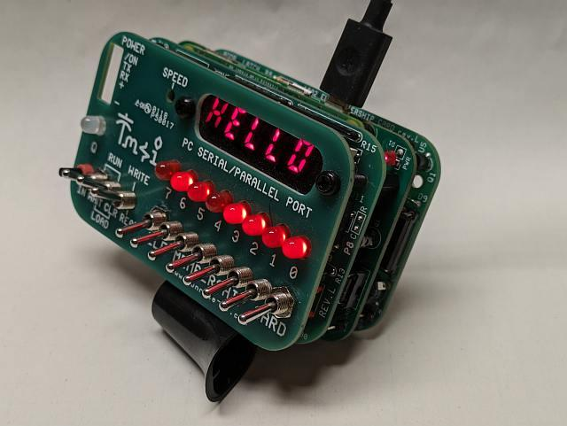
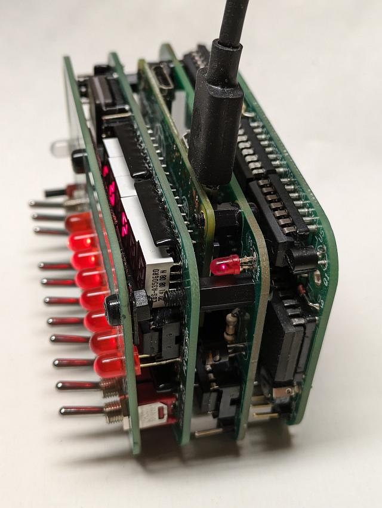
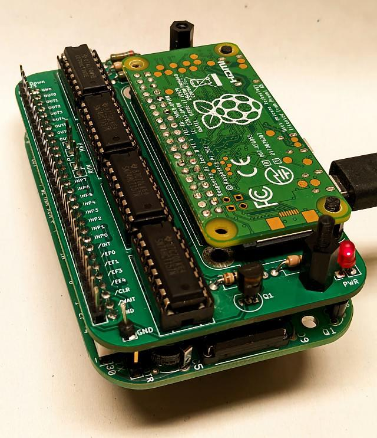
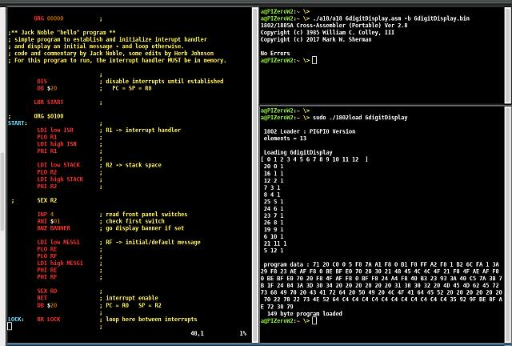
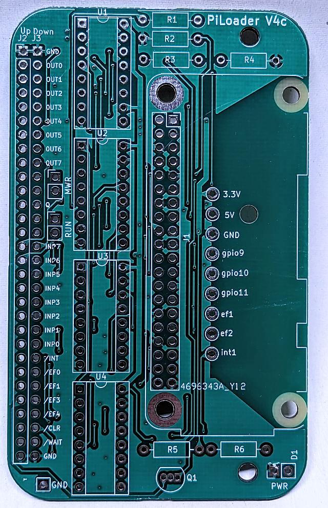
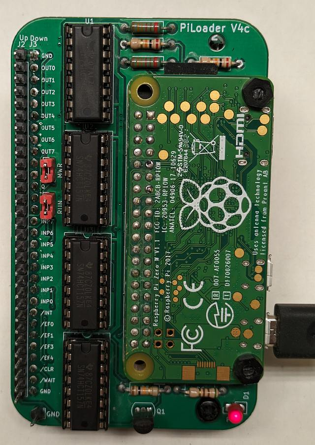

# PiZero Adapter for Lee Hart's Membership Card

There is a lot to like about [Lee Hart’s Membership Card](http://www.sunrise-ev.com/1802.htm "Click this link") (MC). It comes in a compact attractive form factor supporting a 4 MHz 1802, up to 64K of RAM, serial I/O, and lots of switches and blinkenzee lights.  Supplied in kit format, it’s a fun build with an amazing amount of documentation, not to mention Lee Hart’s personal support to help you get things running if you have trouble.

### Front View with PiZero Adapter in the Card Stack

Having said all that, after a few months of usage I felt like there was a little more needed if I was going to do any serious programming with the MC.  Toggling in programs with the front panel switches starts out fun but gets old fast.  Programming EEPROMs is a slow process and they cut into the 64K of available RAM.  Adding serial program download capability to a monitor program is a viable option but requires either an EPROM or a fairly long manual program load via switches.   The earlier MC models had a DB25 connector that could be hooked up to an old school printer port (or GPIO on a microcontroller) but that usually meant an ugly ribbon cable with limited distance cluttering up your workspace.  And the release of the new MC front panel card meant the DB25 went away in favour of six 7 segment LED’s.

### Side View Showing USB Power Connection to Raspberry Pi Running the Card Stack

So I’ve designed and built a PCB Raspberry PiZero W loader card that’s format compatible with the MC and  inserts in the middle of the Membership card’s two card stack.  That maintains the look and feel of the MC while allowing just a thin 5V power cable as the only hookup to the MC.  The built-in Pi Zero contains my complete 1802 development environment (editor & A18 & source files) interfaced with a few simple scripts to the 1802 itself. 

And the best part is that it's all 100% accessible via WiFi from any PC or laptop running SSH. Alternatively you can attach a USB keyboard and HDMI (or composite video monitor) for local programming. And maybe even a GUI based environment if that interests you. (Of course the GUI option could be used remotely over X or via VNC).

### Running Without Front Panel

## Features
<ol>
<li>Create 1802 programs, edit, assemble, and load to MC's 1802 memory entirely over Wifi</li>
<li>Programs loaded to 1802 memory via DMA and override of the MC front panel switches</li>
<li>PiZero can start, halt, or reset 1802 in addition to loading code to memory. 
<li>Intercepts the 1802's interrupt signal from the front panel when PiZero is in control so that front panel interrupts from LED MUX circuit don't disrupt downloads.</li>
<li>Serial console interface for terminal I/O between PiZero and 1802 via Q & EF3 to PiZero's UART GPIO pins (with PiZero running minicom)</li>
<li>Able to read parallel output from 1802 to MC Front Panel for debugging or for high speed data exchange between PiZero&1802 in conjunction with switch overrides</li>
<li>Prototype interconnect area with connections for three uncommitted PiZero GPIO pins and the 1802 ef1, ef2, & interrupt pins (plus 5v , 3.3v, & GND)</li>
<li>Jumpers to short the MWR and RUN connections from front panel.</li>
<li>Power, USB, HDMI, and composite video available via accessible PiZero connectors on rear of stack</li>
<li>Power both MC and PiZero via a single USB wall wart</li>
<li>Maintains MC's all-in-one compact form factor (requires extension ring to fit into Altoids tin)</li>
<li>Works with either version of MC front panel. Or without any front panel</li>
<li>Safely manages 3.3v to 5v to 3.3v level conversions as needed</li>
<li>Ground connection post for scope or logic probe.
<li>PiZero utility written in C to load program code to 1802</li>
</ol>

### Development Environment

### Local Terminal Mode

### link > [PiLoader Schematic](schematic.pdf)

### Bare PCB

### Top View without Front Panel

<table> 
    <tr>
        <td>1802</td><td>1.8 or 4 MHz</td>
    </tr>
    <tr>
        <td>Raspberry Pi</td><td>Wifi HDMI USB</td>
    </tr>
    <tr>
        <td>Software</td><td>Loader Program</td>
    </tr>
</table>

<B>Tags</B> : eclectic retro mishmash fusion retro-futurism anachronism CDP1802

### Project Web Page :  [ http://anthonylhill.github.io ](http://anthonylhill.github.io)